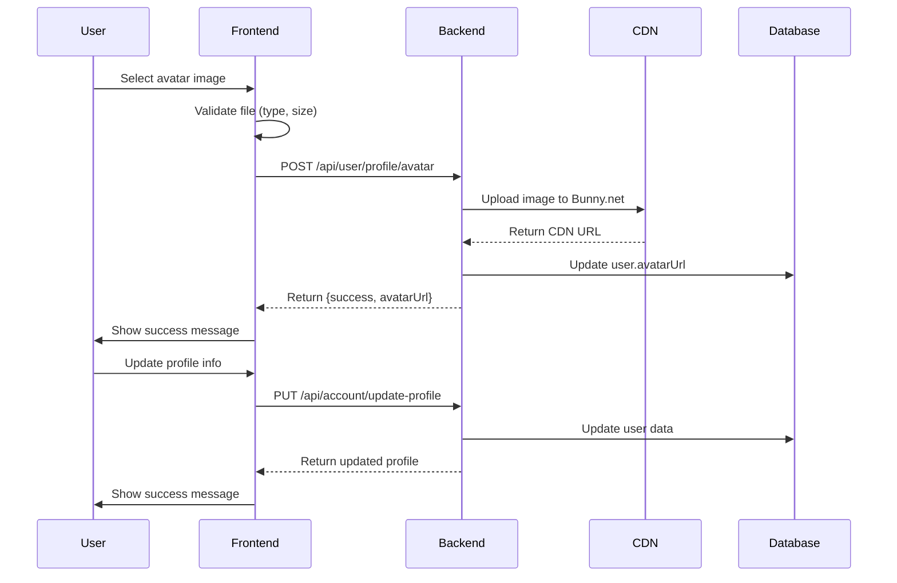
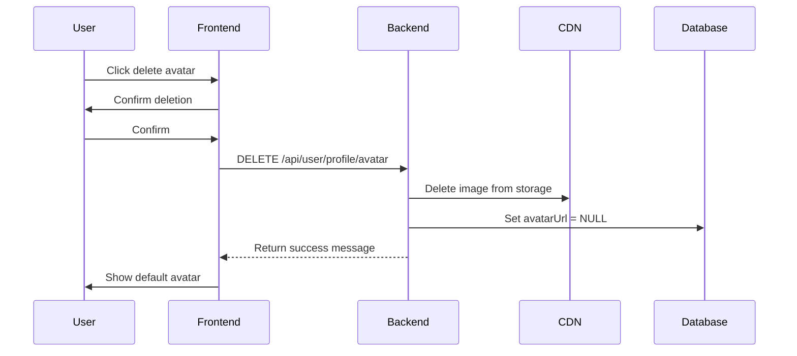

# 📋 Backend API Report - Profile Management & Avatar Upload

**Date:** November 21, 2025  
**Frontend:** Angular 18 Standalone Components  
**Purpose:** Documentation of Profile Management & Avatar Upload Nodes for Backend Development

---

## 🎯 Overview

This document provides a comprehensive analysis of all API endpoints (nodes) used in the Profile Management system, specifically focusing on:
- User Profile CRUD operations
- Avatar/Profile Picture upload and management
- Authentication and authorization requirements

---

## 📍 API Base URLs

```typescript
// Primary API endpoints
const API_BASE_URL = 'https://naplan2.runasp.net/api';

// Service-specific endpoints
const USER_API = `${API_BASE_URL}/user`;
const ACCOUNT_API = `${API_BASE_URL}/account`;
const MEDIA_API = `${API_BASE_URL}/media`;
```

---

## 🔐 Authentication

All profile-related endpoints require **Bearer Token Authentication**:

```http
Authorization: Bearer {JWT_TOKEN}
```

Token is stored in `localStorage.getItem('token')` and sent with every request.

---

## 📡 API Endpoints (Nodes)

### 1. **GET Profile Information**

#### **Endpoint:** `GET /api/user/profile`

**Purpose:** Retrieve current authenticated user's profile information

**Request:**
```http
GET https://naplan2.runasp.net/api/user/profile
Authorization: Bearer {token}
```

**Expected Response (200 OK):**
```json
{
  "userId": 123,
  "userName": "john_doe",
  "firstName": "John",
  "email": "john@example.com",
  "age": 25,
  "phoneNumber": "+1234567890",
  "createdAt": "2024-01-15T10:30:00Z",
  "roles": ["Student"],
  "avatarUrl": "https://cdn.example.com/avatars/user123.jpg",
  "avatar": "https://cdn.example.com/avatars/user123.jpg",
  "role": "Student",
  "emailConfirmed": true,
  "phoneNumberConfirmed": false,
  "twoFactorEnabled": false,
  "studentData": {
    "studentId": 456,
    "yearId": 7,
    "yearNumber": 7,
    "parentId": 789,
    "parentName": "Jane Doe"
  }
}
```

**Error Responses:**
- `401 Unauthorized` - Invalid or expired token
- `404 Not Found` - User profile not found
- `500 Internal Server Error` - Server error

**Used In:**
- `ProfileService.getProfile()`
- `ProfileManagementComponent.loadProfile()`
- `ProfileEditComponent.loadCurrentProfile()`

---

### 2. **PUT Update Profile**

#### **Endpoint:** `PUT /api/account/update-profile`

**Purpose:** Update user profile information (name, email, age, phone)

**Request:**
```http
PUT https://naplan2.runasp.net/api/account/update-profile
Authorization: Bearer {token}
Content-Type: application/json

{
  "userName": "john_doe_updated",
  "email": "john.new@example.com",
  "age": 26,
  "phoneNumber": "+1234567890",
  "avatarUrl": "https://cdn.example.com/avatars/new-avatar.jpg"
}
```

**Request Body Schema:**
```typescript
interface UpdateProfileRequest {
  userName?: string;      // Username (min 3 characters)
  email?: string;         // Valid email format
  age?: number;          // Age between 1-120
  phoneNumber?: string;  // Phone number (optional)
  avatarUrl?: string;    // Avatar URL (optional)
}
```

**Expected Response (200 OK):**
```json
{
  "success": true,
  "message": "Profile updated successfully",
  "data": {
    "userName": "john_doe_updated",
    "email": "john.new@example.com",
    "age": 26,
    "phoneNumber": "+1234567890",
    "avatarUrl": "https://cdn.example.com/avatars/new-avatar.jpg"
  }
}
```

**Error Responses:**
- `400 Bad Request` - Validation errors
  ```json
  {
    "success": false,
    "message": "Validation failed",
    "errors": {
      "UserName": ["Username must be at least 3 characters"],
      "Email": ["Invalid email format"],
      "Age": ["Age must be between 1 and 120"]
    }
  }
  ```
- `401 Unauthorized` - Invalid token
- `409 Conflict` - Username or email already exists
- `500 Internal Server Error` - Server error

**Used In:**
- `ProfileService.updateProfile()`
- `ProfileEditComponent.updateProfile()`
- `ProfileManagementComponent.updateProfile()`

---

### 3. **POST Upload Avatar (NEW API - Bunny.net CDN)**

#### **Endpoint:** `POST /api/user/profile/avatar`

**Purpose:** Upload and replace user's profile picture using Bunny.net CDN

**Request:**
```http
POST https://naplan2.runasp.net/api/user/profile/avatar
Authorization: Bearer {token}
Content-Type: multipart/form-data

FormData:
  file: [binary image data]
```

**Request Details:**
- **Content-Type:** `multipart/form-data`
- **Field Name:** `file`
- **Accepted File Types:** JPG, JPEG, PNG, GIF
- **Max File Size:** 5MB
- **Validation:**
  - Image dimensions: Recommended 200x200 to 1000x1000
  - File must be a valid image

**Expected Response (200 OK):**
```json
{
  "success": true,
  "avatarUrl": "https://naplan-cdn.b-cdn.net/avatars/user123_20251121.jpg",
  "message": "Avatar uploaded successfully"
}
```

**Important Backend Notes:**
1. **Auto-Delete Old Avatar:** Backend should automatically delete the user's old avatar before uploading new one
2. **CDN Upload:** Upload to Bunny.net CDN storage
3. **URL Generation:** Generate and return public CDN URL
4. **Database Update:** Update user's `avatarUrl` field in database
5. **File Naming:** Suggested format: `user{userId}_{timestamp}.{ext}`

**Error Responses:**
- `400 Bad Request` - Invalid file type or size
  ```json
  {
    "success": false,
    "message": "File size must be less than 5MB"
  }
  ```
- `401 Unauthorized` - Invalid token
- `415 Unsupported Media Type` - Invalid file format
- `500 Internal Server Error` - Upload failed

**Used In:**
- `ProfileService.uploadAvatar(file: File)`
- `ProfileManagementComponent.uploadAvatar()`
- `ProfileEditComponent.updateProfile()`

**Sample Frontend Code:**
```typescript
// Create FormData
const formData = new FormData();
formData.append('file', selectedFile);

// Upload to backend
this.http.post<AvatarUploadResponse>(
  'https://naplan2.runasp.net/api/user/profile/avatar',
  formData,
  {
    headers: {
      'Authorization': `Bearer ${token}`
    }
  }
).subscribe({
  next: (response) => {
    console.log('Avatar URL:', response.avatarUrl);
    // Update UI with new avatar
  },
  error: (error) => {
    console.error('Upload failed:', error);
  }
});
```

---

### 4. **DELETE Avatar**

#### **Endpoint:** `DELETE /api/user/profile/avatar`

**Purpose:** Delete user's current profile picture

**Request:**
```http
DELETE https://naplan2.runasp.net/api/user/profile/avatar
Authorization: Bearer {token}
```

**Expected Response (200 OK):**
```json
{
  "message": "Profile picture deleted successfully"
}
```

**Backend Requirements:**
1. Delete avatar file from CDN/storage
2. Set user's `avatarUrl` to NULL in database
3. Return success message

**Error Responses:**
- `401 Unauthorized` - Invalid token
- `404 Not Found` - No avatar to delete
- `500 Internal Server Error` - Deletion failed

**Used In:**
- `ProfileService.deleteAvatar()`
- `ProfileManagementComponent.deleteAvatar()`

---

### 5. **GET User by ID** (Legacy/Admin)

#### **Endpoint:** `GET /api/user/{userId}`

**Purpose:** Get user profile by specific user ID (used in admin views)

**Request:**
```http
GET https://naplan2.runasp.net/api/user/123
Authorization: Bearer {token}
```

**Expected Response (200 OK):**
```json
{
  "id": 123,
  "userName": "john_doe",
  "normalizedUserName": "JOHN_DOE",
  "email": "john@example.com",
  "normalizedEmail": "JOHN@EXAMPLE.COM",
  "emailConfirmed": true,
  "phoneNumber": "+1234567890",
  "phoneNumberConfirmed": false,
  "twoFactorEnabled": false,
  "age": 25,
  "createdAt": "2024-01-15T10:30:00Z",
  "avatarUrl": "https://cdn.example.com/avatars/user123.jpg",
  "student": null,
  "students": [],
  "notifications": [],
  "userRoles": [],
  "teachings": []
}
```

**Used In:**
- `UserProfileComponent.fetchUserData()`

---

### 6. **PUT Update User by ID** (Legacy)

#### **Endpoint:** `PUT /api/user/{userId}`

**Purpose:** Update user by ID (admin functionality)

**Request:**
```http
PUT https://naplan2.runasp.net/api/user/123
Authorization: Bearer {token}
Content-Type: application/json

{
  "userName": "updated_username",
  "email": "updated@example.com",
  "age": 26,
  "phoneNumber": "+9876543210"
}
```

**Expected Response (200 OK):**
```json
{
  "id": 123,
  "userName": "updated_username",
  "email": "updated@example.com",
  "age": 26,
  "phoneNumber": "+9876543210",
  // ... other user fields
}
```

**Used In:**
- `UserProfileComponent.saveUserProfile()`

---

### 7. **POST Upload Image (OLD/DEPRECATED)**

#### **Endpoint:** `POST /api/media/upload-image`

**⚠️ Status:** DEPRECATED - Use `/api/user/profile/avatar` instead

**Purpose:** General image upload to media storage

**Request:**
```http
POST https://naplan2.runasp.net/api/media/upload-image
Authorization: Bearer {token}
Content-Type: multipart/form-data

FormData:
  file: [binary data]
  folder: "profiles"
```

**Expected Response (200 OK):**
```json
{
  "url": "https://storage.example.com/profiles/image123.jpg",
  "storagePath": "/uploads/profiles/image123.jpg",
  "success": true
}
```

**Note:** This endpoint is still available but should NOT be used for avatar uploads. Use the new `/api/user/profile/avatar` endpoint instead.

**Used In:**
- `ProfileService.uploadAvatarOld()` (deprecated method)

---

## 🔄 Complete User Flow

### **Scenario 1: User Updates Profile with New Avatar**



### **Scenario 2: User Deletes Avatar**



---

## 📊 Data Models

### **UserProfile Interface (Frontend)**

```typescript
interface UserProfile {
  userId: number;
  userName: string;
  firstName: string | null;
  email: string;
  age: number;
  phoneNumber: string | null;
  createdAt: string;
  roles: string[];
  studentData: StudentProfileData | null;
  avatar?: string;
  avatarUrl?: string;
  role?: string;
  emailConfirmed?: boolean;
  phoneNumberConfirmed?: boolean;
  twoFactorEnabled?: boolean;
}
```

### **UpdateProfileRequest (Frontend)**

```typescript
interface UpdateProfileRequest {
  userName?: string;      // Min 3 characters
  email?: string;         // Valid email
  age?: number;          // 1-120
  phoneNumber?: string;  // Optional
  avatarUrl?: string;    // CDN URL
}
```

### **AvatarUploadResponse (Backend Expected)**

```typescript
interface AvatarUploadResponse {
  success: boolean;
  avatarUrl?: string;    // Full CDN URL
  message: string;
}
```

---

## ✅ Validation Rules

### **Profile Update Validation**

| Field | Required | Type | Constraints |
|-------|----------|------|-------------|
| userName | Yes | string | Min: 3 chars, Max: 50 chars, Alphanumeric + underscore |
| email | Yes | string | Valid email format, Unique |
| age | Yes | number | Min: 1, Max: 120 |
| phoneNumber | No | string | Valid phone format (allow international) |
| avatarUrl | No | string | Valid URL format |

### **Avatar Upload Validation**

| Property | Constraint |
|----------|------------|
| File Types | JPG, JPEG, PNG, GIF |
| Max Size | 5MB |
| Recommended Dimensions | 200x200 to 1000x1000 pixels |
| Must Be | Valid image file |

---

## 🎨 Frontend File Upload Implementation

### **File Selection & Preview**

```typescript
onFileSelected(event: Event): void {
  const input = event.target as HTMLInputElement;
  const file = input.files?.[0];
  
  if (!file) return;
  
  // Validate type
  const allowedTypes = ['image/jpeg', 'image/jpg', 'image/png', 'image/gif'];
  if (!allowedTypes.includes(file.type)) {
    // Show error
    return;
  }
  
  // Validate size (5MB)
  if (file.size > 5 * 1024 * 1024) {
    // Show error
    return;
  }
  
  // Create preview
  const reader = new FileReader();
  reader.onload = (e) => {
    this.imagePreview = e.target?.result as string;
  };
  reader.readAsDataURL(file);
  
  // Auto-upload
  this.uploadAvatar(file);
}
```

### **Avatar Upload with FormData**

```typescript
uploadAvatar(file: File): Observable<AvatarUploadResponse> {
  const formData = new FormData();
  formData.append('file', file);
  
  return this.http.post<AvatarUploadResponse>(
    `${this.apiUrl}/profile/avatar`,
    formData,
    {
      headers: {
        'Authorization': `Bearer ${localStorage.getItem('token')}`
      }
    }
  );
}
```

---

## 🚨 Error Handling

### **Common Error Scenarios**

| Status Code | Scenario | Frontend Action |
|-------------|----------|-----------------|
| 400 | Invalid file type/size | Show validation error |
| 401 | Unauthorized | Redirect to login |
| 404 | Profile not found | Show error message |
| 409 | Username/email conflict | Show conflict error |
| 413 | File too large | Show size limit error |
| 415 | Unsupported media type | Show file type error |
| 500 | Server error | Show generic error, retry option |

### **Frontend Error Handler Example**

```typescript
.subscribe({
  next: (response) => {
    // Success
  },
  error: (error) => {
    let message = 'An error occurred';
    
    if (error.status === 401) {
      message = 'Session expired. Please login again.';
      this.router.navigate(['/login']);
    } else if (error.status === 400) {
      message = error.error?.message || 'Invalid input';
    } else if (error.status === 413) {
      message = 'File is too large. Max 5MB allowed.';
    } else if (error.status === 415) {
      message = 'Invalid file type. Only JPG, PNG, GIF allowed.';
    } else if (error.status === 500) {
      message = 'Server error. Please try again later.';
    }
    
    Swal.fire({ icon: 'error', title: 'Error', text: message });
  }
});
```

---

## 📸 Avatar Upload Backend Requirements

### **Step-by-Step Backend Process**

1. **Receive Upload Request**
   ```csharp
   [HttpPost("profile/avatar")]
   [Authorize]
   public async Task<IActionResult> UploadAvatar(IFormFile file)
   ```

2. **Validate File**
   - Check file is not null
   - Validate file type (JPG, PNG, GIF)
   - Validate file size (max 5MB)
   - Validate it's a valid image

3. **Get Current User**
   ```csharp
   var userId = User.FindFirst(ClaimTypes.NameIdentifier)?.Value;
   var user = await _userManager.FindByIdAsync(userId);
   ```

4. **Delete Old Avatar (if exists)**
   ```csharp
   if (!string.IsNullOrEmpty(user.AvatarUrl))
   {
       await _cdnService.DeleteFileAsync(user.AvatarUrl);
   }
   ```

5. **Upload to Bunny.net CDN**
   ```csharp
   var fileName = $"user{userId}_{DateTime.UtcNow:yyyyMMddHHmmss}.{extension}";
   var cdnUrl = await _bunnyNetService.UploadImageAsync(file, "avatars", fileName);
   ```

6. **Update Database**
   ```csharp
   user.AvatarUrl = cdnUrl;
   await _userManager.UpdateAsync(user);
   ```

7. **Return Response**
   ```csharp
   return Ok(new {
       success = true,
       avatarUrl = cdnUrl,
       message = "Avatar uploaded successfully"
   });
   ```

### **Recommended Database Schema**

```sql
-- User table should have:
ALTER TABLE AspNetUsers ADD AvatarUrl NVARCHAR(500) NULL;

-- Index for faster queries
CREATE INDEX IX_AspNetUsers_AvatarUrl ON AspNetUsers(AvatarUrl);
```

---

## 🔒 Security Considerations

### **Backend Security Checklist**

- ✅ **Authentication:** All endpoints require valid JWT token
- ✅ **Authorization:** Users can only update their own profile
- ✅ **File Validation:**
  - Check file extension
  - Validate MIME type
  - Scan file content (magic bytes)
  - Reject executable files
- ✅ **Size Limits:** Enforce 5MB max file size
- ✅ **Rate Limiting:** Limit upload requests (e.g., 5 uploads per hour per user)
- ✅ **Input Sanitization:** Sanitize all user inputs (username, email, etc.)
- ✅ **SQL Injection Prevention:** Use parameterized queries
- ✅ **XSS Prevention:** Encode output
- ✅ **CSRF Protection:** Implement CSRF tokens
- ✅ **HTTPS Only:** All requests over HTTPS
- ✅ **CDN Security:** Use signed URLs or access tokens for CDN

---

## 📈 Performance Optimization

### **Backend Recommendations**

1. **Async Operations:** Use async/await for all I/O operations
2. **Image Optimization:**
   - Resize images to standard sizes (e.g., 400x400)
   - Compress images (70-80% quality)
   - Convert to WebP format for better compression
3. **CDN Caching:** Set proper cache headers
4. **Database Indexing:** Index avatarUrl field
5. **Background Jobs:** Process large uploads in background
6. **Monitoring:** Log upload success/failure rates

---

## 🧪 Testing Endpoints

### **Postman/cURL Examples**

#### **1. Get Profile**
```bash
curl -X GET https://naplan2.runasp.net/api/user/profile \
  -H "Authorization: Bearer YOUR_JWT_TOKEN"
```

#### **2. Update Profile**
```bash
curl -X PUT https://naplan2.runasp.net/api/account/update-profile \
  -H "Authorization: Bearer YOUR_JWT_TOKEN" \
  -H "Content-Type: application/json" \
  -d '{
    "userName": "new_username",
    "email": "new@example.com",
    "age": 25,
    "phoneNumber": "+1234567890"
  }'
```

#### **3. Upload Avatar**
```bash
curl -X POST https://naplan2.runasp.net/api/user/profile/avatar \
  -H "Authorization: Bearer YOUR_JWT_TOKEN" \
  -F "file=@/path/to/avatar.jpg"
```

#### **4. Delete Avatar**
```bash
curl -X DELETE https://naplan2.runasp.net/api/user/profile/avatar \
  -H "Authorization: Bearer YOUR_JWT_TOKEN"
```

---

## 📝 Summary

### **Total API Nodes Required**

| # | Method | Endpoint | Purpose | Priority |
|---|--------|----------|---------|----------|
| 1 | GET | `/api/user/profile` | Get current user profile | ✅ High |
| 2 | PUT | `/api/account/update-profile` | Update profile info | ✅ High |
| 3 | POST | `/api/user/profile/avatar` | Upload avatar (Bunny.net) | ✅ High |
| 4 | DELETE | `/api/user/profile/avatar` | Delete avatar | ✅ High |
| 5 | GET | `/api/user/{id}` | Get user by ID (admin) | ⚠️ Medium |
| 6 | PUT | `/api/user/{id}` | Update user by ID (admin) | ⚠️ Medium |

### **Critical Notes for Backend Team**

1. **Avatar Upload Endpoint is NEW** - Must implement Bunny.net CDN integration
2. **Auto-delete old avatars** - When new avatar uploaded, delete old one from CDN
3. **Return full CDN URL** - Frontend expects complete URL in response
4. **File validation is critical** - Implement robust file type and size validation
5. **Update profile endpoint** - Should accept optional `avatarUrl` field
6. **Error messages** - Return clear, actionable error messages
7. **Database field** - Add `AvatarUrl` column to Users table if not exists

---

## 📞 Contact & Support

**Frontend Developer:** [Your Name]  
**Date Created:** November 21, 2025  
**Last Updated:** November 21, 2025  
**Version:** 1.0

---

**End of Report** ✅
