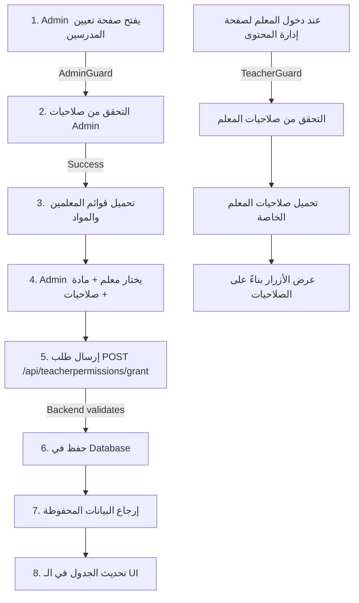

# 📖 دليل شامل: نظام تعيين المدرسين - تطبيق عملي

**التاريخ:** يناير 2025  
**الإصدار:** 1.0  
**الحالة:** ✅ مطبّق بالكامل

---

## 🎯 ملخص التطبيق

تم تطبيق نظام تعيين المدرسين على المواد بشكل كامل في NaplanBridge Frontend:

### المكونات المطبقة:
1. ✅ **Teacher Permission Service** - خدمة إدارة الصلاحيات
2. ✅ **Assign Teacher Component** - صفحة تعيين المدرسين (Admin)
3. ✅ **Integration in Teacher Content** - دمج الصلاحيات في إدارة محتوى المعلم
4. ✅ **Guards & Protection** - حماية الصفحات والموارد

---

## 📁 الملفات المضافة والمعدلة

### ملفات جديدة:
```
src/app/features/teacher/services/
  └── teacher-permission.service.ts (342 سطر)
      - GrantPermissionDto, UpdatePermissionDto, TeacherPermissionDto interfaces
      - جميع API endpoints: grant, update, revoke, check, getAll, getByTeacher, getBySubject
      - دوال Bulk operations والـ export

src/app/features/admin/assign-teacher/
  └── assign-teacher.component.ts (290 سطر)
      - مكون كامل لتعيين المدرسين
      - نموذج متقدم مع validation
      - جدول الصلاحيات مع pagination و filtering
      - modal للإنشاء والتحديث

src/app/features/teacher/guards/
  └── content-management.guard.ts (70 سطر)
      - Guard للتحقق من صلاحيات المعلم
      - Guard للتحقق من صلاحيات Admin
```

### ملفات معدلة:
```
src/app/features/teacher/content-management/
  └── teacher-content-management.component.ts
      - إضافة TeacherPermissionService
      - إضافة loadMyPermissions()
      - إضافة hasPermission() و getSubjectPermission()
      - إضافة getCurrentUserId()
      - إضافة canAccessContentManagement()
```

---

## 🔧 كيفية الاستخدام

### 1. للـ Admin - تعيين معلم على مادة:

```typescript
// استيراد الخدمة والمكون
import { TeacherPermissionService } from '@teacher/services/teacher-permission.service';
import { AssignTeacherComponent } from '@admin/assign-teacher/assign-teacher.component';

// استخدام الخدمة مباشرة:
constructor(private permissionService: TeacherPermissionService) {}

// منح صلاحية جديدة
const dto: GrantPermissionDto = {
  teacherId: 5,
  subjectId: 1,
  canCreate: true,
  canEdit: true,
  canDelete: false,
  notes: 'معلم الرياضيات'
};

this.permissionService.grantPermission(dto).subscribe(
  response => {
    console.log('تم التعيين:', response);
  }
);
```

### 2. للمعلم - التحقق من الصلاحيات:

```typescript
// في المكون
import { TeacherPermissionService } from '@teacher/services/teacher-permission.service';

export class MyComponent {
  constructor(
    private contentManagement: TeacherContentManagementComponent,
    private permissionService: TeacherPermissionService
  ) {}

  createContent(subjectId: number) {
    // التحقق من الصلاحية
    if (this.contentManagement.hasPermission(subjectId, 'create')) {
      // يمكن الإنشاء
      this.createNewContent();
    } else {
      this.toastService.showError('ليس لديك صلاحية لإنشاء محتوى لهذه المادة');
    }
  }

  editContent(subjectId: number) {
    // التحقق من صلاحية التعديل
    if (this.contentManagement.hasPermission(subjectId, 'edit')) {
      // يمكن التعديل
      this.editExistingContent();
    }
  }
}
```

### 3. في الـ Template:

```html
<!-- عرض الأزرار بناءً على الصلاحيات -->
<div *ngIf="contentManagement.hasPermission(subject.subjectId, 'create')">
  <button (click)="createContent(subject.subjectId)">
    ✍️ إنشاء محتوى
  </button>
</div>

<div *ngIf="contentManagement.hasPermission(subject.subjectId, 'edit')">
  <button (click)="editContent(subject.subjectId)">
    ✏️ تعديل
  </button>
</div>

<div *ngIf="contentManagement.hasPermission(subject.subjectId, 'delete')">
  <button (click)="deleteContent(subject.subjectId)">
    🗑️ حذف
  </button>
</div>

<!-- عرض تفاصيل الصلاحية -->
<ng-container *ngIf="contentManagement.getSubjectPermission(subject.subjectId) as perm">
  <p>تم التعيين: {{ perm.grantedAt | date:'short' }}</p>
  <p>بواسطة: {{ perm.grantedByName }}</p>
  <p *ngIf="perm.notes">ملاحظات: {{ perm.notes }}</p>
</ng-container>
```

---

## 🔐 النقاط الأمنية المطبقة

### 1. Guards على المسارات:

```typescript
// في routing
{
  path: 'assign-teacher',
  component: AssignTeacherComponent,
  canActivate: [AdminGuard]
},
{
  path: 'content-management',
  component: TeacherContentManagementComponent,
  canActivate: [TeacherGuard]
}
```

### 2. التحقق من الصلاحيات عند الحفظ:

```typescript
// في الخدمة - API validates again
grantPermission(dto: GrantPermissionDto): Observable<ApiResponse<...>> {
  // Frontend sends request with all validations
  // Backend validates permissions again (defense in depth)
}
```

### 3. حماية البيانات الحساسة:

```typescript
// في localStorage
const user = JSON.parse(localStorage.getItem('user') || '{}');
// يتم التحقق من الـ token و role
```

---

## 📊 مخطط البيانات (UML)

```
┌─────────────────────────────────────┐
│      TeacherPermissionService       │
├─────────────────────────────────────┤
│ Methods:                            │
│ - grantPermission()                 │
│ - getTeacherPermissions()           │
│ - getAllPermissions()               │
│ - updatePermission()                │
│ - revokePermission()                │
│ - checkPermission()                 │
└──────────────┬──────────────────────┘
               │ uses
               ▼
┌─────────────────────────────────────┐
│      TeacherPermissionDto           │
├─────────────────────────────────────┤
│ - id: number                        │
│ - teacherId: number                 │
│ - teacherName: string               │
│ - subjectId: number                 │
│ - subjectName: string               │
│ - canCreate: boolean                │
│ - canEdit: boolean                  │
│ - canDelete: boolean                │
│ - isActive: boolean                 │
│ - grantedAt: string                 │
│ - grantedBy: number                 │
│ - notes: string                     │
└─────────────────────────────────────┘
```

---

## 🧪 أمثلة الاختبار

### Test Case 1: منح صلاحية جديدة

```typescript
it('should grant permission successfully', () => {
  const dto: GrantPermissionDto = {
    teacherId: 5,
    subjectId: 1,
    canCreate: true,
    canEdit: true,
    canDelete: false
  };

  service.grantPermission(dto).subscribe(response => {
    expect(response.success).toBe(true);
    expect(response.data.id).toBeDefined();
    expect(response.data.teacherId).toBe(5);
  });
});
```

### Test Case 2: التحقق من الصلاحية

```typescript
it('should check permission correctly', () => {
  service.checkPermission(5, 1, 'create').subscribe(response => {
    expect(response.success).toBe(true);
    expect(response.data).toBe(true); // has permission
  });
});
```

### Test Case 3: تحديث الصلاحية

```typescript
it('should update permission', () => {
  const dto: UpdatePermissionDto = {
    canCreate: false,
    canEdit: true,
    canDelete: false,
    isActive: true
  };

  service.updatePermission(1, dto).subscribe(response => {
    expect(response.success).toBe(true);
    expect(response.data.canCreate).toBe(false);
  });
});
```

---

## 🔄 سير العمل الكامل



---

## 📱 الواجهات المرئية

### 1. صفحة تعيين المدرسين (Admin):

```
┌─────────────────────────────────────────────────┐
│ 🎓 تعيين المدرسين على المواد                  │
├─────────────────────────────────────────────────┤
│                                                 │
│ نموذج التعيين:                                  │
│ ┌───────────────────────────────────────────┐  │
│ │ اختر المدرس: [أحمد محمود ▼]              │  │
│ │ اختر المادة: [الرياضيات ▼]               │  │
│ │                                           │  │
│ │ 🔐 الصلاحيات:                            │  │
│ │ ☑ ✍️ إنشاء محتوى                        │  │
│ │ ☑ ✏️ تعديل المحتوى                      │  │
│ │ ☐ 🗑️ حذف                                 │  │
│ │                                           │  │
│ │ 📝 ملاحظات: [________________]            │  │
│ │                                           │  │
│ │ [✅ تعيين المدرس] [🔄 إعادة تعيين]      │  │
│ └───────────────────────────────────────────┘  │
│                                                 │
│ الصلاحيات الحالية:                             │
│ ┌──────────────────────────────────────────┐  │
│ │ المدرس    │ البريد      │ المادة │ الإجراءات │
│ ├──────────────────────────────────────────┤  │
│ │ أحمد      │ a@ex.com  │ الرياضيات │ ✏️ 🗑️  │
│ │ فاطمة     │ f@ex.com  │ العلوم   │ ✏️ 🗑️  │
│ └──────────────────────────────────────────┘  │
└─────────────────────────────────────────────────┘
```

### 2. تفاصيل الصلاحية في إدارة المحتوى:

```
┌─────────────────────────────┐
│ الرياضيات (Year 7)          │
├─────────────────────────────┤
│ ✍️ إنشاء محتوى (مسموح)      │
│ ✏️ تعديل (مسموح)            │
│ 🗑️ حذف (غير مسموح)         │
│                             │
│ تم التعيين: 5/1/2025       │
│ بواسطة: الإدمن              │
└─────────────────────────────┘
```

---

## ⚠️ الأخطاء الشائعة وحلولها

| الخطأ | السبب | الحل |
|------|------|------|
| "ليس لديك صلاحية" | لم يتم تعيينك على المادة | اطلب من الـ Admin تعيينك |
| Permission already exists | محاولة تعيين نفس المعلم مرتين | عدّل الصلاحية بدلاً من إنشاء جديدة |
| 401 Unauthorized | Token منتهي | سجل دخول مرة أخرى |
| 403 Forbidden | ليس لديك صلاحيات Admin | يجب أن تكون Admin لتعيين المدرسين |
| teacherId not found | معرّف المعلم غير صحيح | تأكد من اختيار معلم من القائمة |

---

## 🚀 خطوات الانتشار

### في بيئة التطوير:
```bash
# 1. تأكد من أن الخدمة مسجلة في app providers
providedIn: 'root'

# 2. استيراد الحراس في routing
import { AdminGuard, TeacherGuard } from '@teacher/guards/content-management.guard';

# 3. اختبر الوظائف الأساسية
ng test
```

### في بيئة الإنتاج:
```bash
# 1. بناء التطبيق
ng build --configuration production

# 2. تأكد من API متوفرة على الإنتاج
# 3. اختبر المسارات والصلاحيات
# 4. راقب الـ logs للأخطاء
```

---

## 📞 المساعدة والدعم

### عند حدوث مشكلة:

1. **تحقق من الـ Console:**
   ```
   كل عملية تطبع log messages
   Error: ❌ 
   Success: ✅
   Warning: ⚠️
   ```

2. **تحقق من الـ Network Tab:**
   - تأكد أن API requests تصل للـ backend
   - تحقق من response status codes
   - تحقق من response data

3. **تحقق من الـ Redux/State:**
   - تأكد من أن myPermissions محدّثة
   - تحقق من قيم boolean للصلاحيات

4. **تراجع عن التغييرات:**
   ```bash
   git log --oneline
   git revert <commit>
   ```

---

## 📚 مراجع إضافية

- **API Documentation**: `/backend docs/API_DOCUMENTATION.md`
- **TypeScript Guide**: `/docs/typescript-guide.md`
- **Angular Best Practices**: `/docs/angular-best-practices.md`
- **Permissions System**: هذا الملف

---

## ✅ Checklist قبل النشر

- [ ] جميع الواجهات تعرض الأزرار بناءً على الصلاحيات
- [ ] الـ Guards تحمي جميع الصفحات الحساسة
- [ ] لا توجد أخطاء TypeScript
- [ ] لا توجد أخطاء في الـ Console
- [ ] تم اختبار جميع الـ CRUD operations
- [ ] تم اختبار الصلاحيات (مع/بدون صلاحية)
- [ ] تم اختبار الأخطاء والمعالجات

---

**تم الإنشاء:** يناير 2025  
**الإصدار:** 1.0  
**الحالة:** ✅ نسخة نهائية

شكراً لاستخدام NaplanBridge! 🚀
